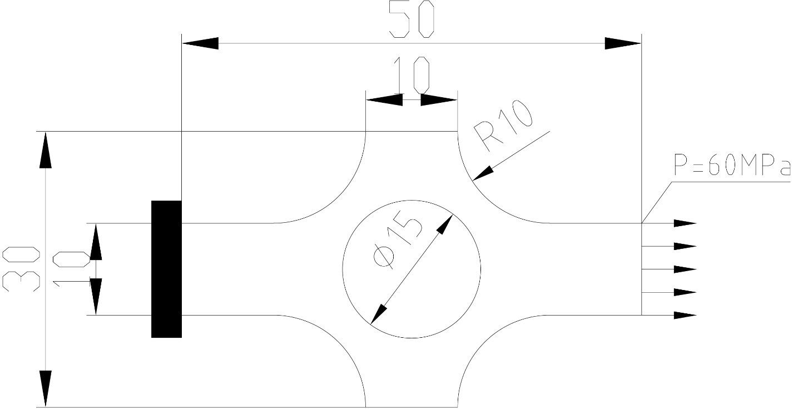
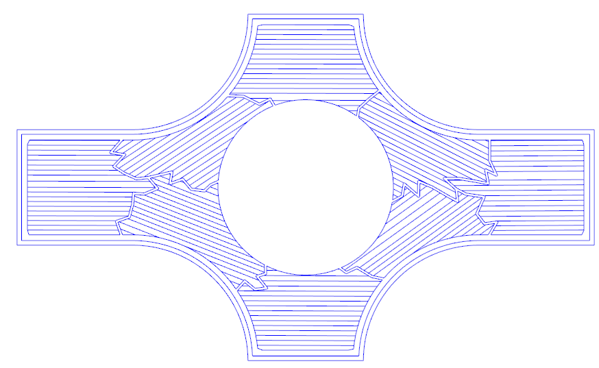
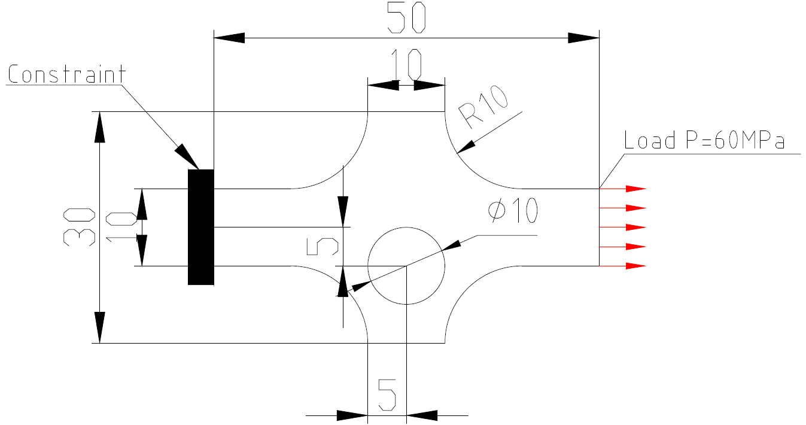
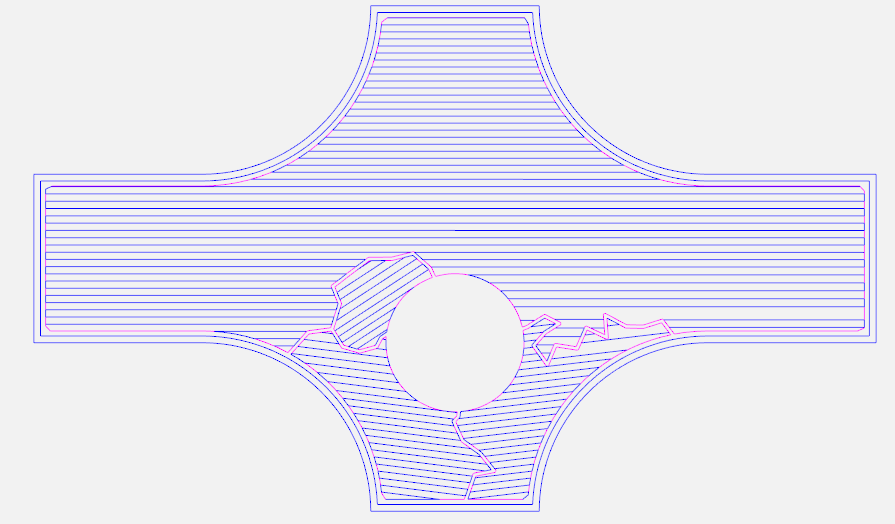
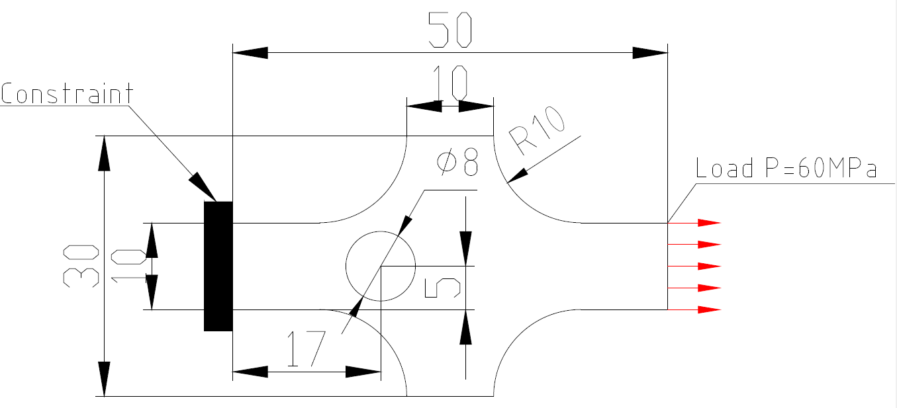
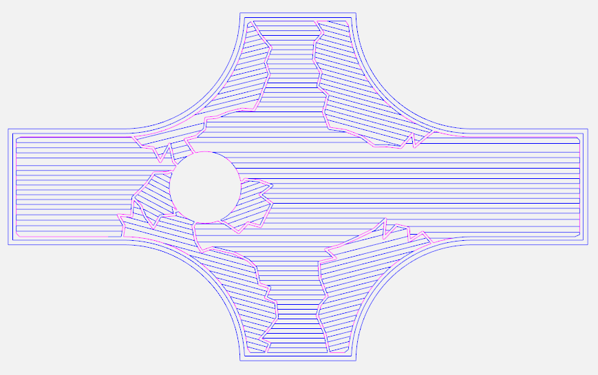

# DisContinuousZigzag

#### Introduction
This project is to generate the printing paths on the planar reinforced layer and processing transitional layer. The processing transitional layer performs the filling strategy staggered with the planar reinforced layer. But the current code shows only the filling path of a single layer.

#### Installation guide

1.  pip install vtk
2.  pip install pyclipper

#### Using instructions

1.  You need to input the closed boundary and referencing angle of the profile. You can use the global function 'genDpPath' to generate the filling paths under the Zizgag.py file. This global function has three arguments. This first one is the outer boundary of the profile. The second is filling spacing. The third one is filling referencing angle.
2. This contour should ensure the counterclockwise outer and clockwise inner contour.
3. If you have problems using an angle equal to zero for filling, please change the angle to 1e-12

#### The following is to show three different paths for a single planar reinforced layer filling
1. Sample One
    
    

2. Sample Two
    
    

3. Sample Three
    
    